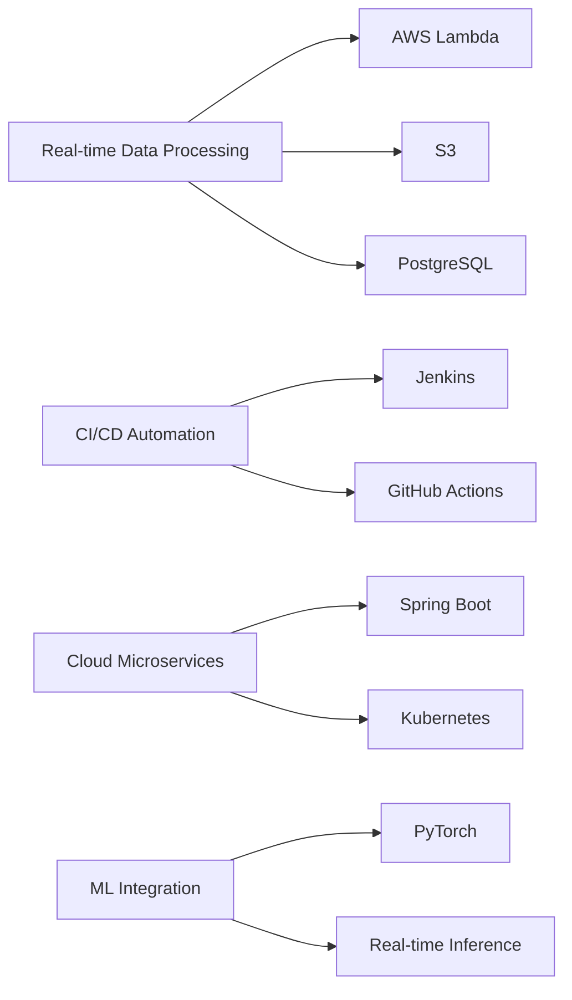

# <div align="center">Hello Everyone</div>

<div align="center">
  
### Senior Software Engineer | Full Stack Developer 🚀

[](https://github.com/popstarlets0173)
[](mailto:beowulf@engineer.com)

</div>

<div align="center">
  
</div>

---

## About Me

I'm a **Senior Software Engineer** with **14+ years** of experience designing and delivering scalable applications across **fintech** and **enterprise systems**. I specialize in **full-stack development**, **machine learning**, **cloud infrastructure**, and **microservices**.

```javascript
const krzysztof = {
    location: "Earth 🌍",
    experience: "14+ years",
    specialties: ["Full-Stack", "ML/AI", "Cloud", "Microservices"],
    currentFocus: "Building scalable, intelligent systems",
    funFact: "I turn coffee into code ☕️"
};
```

---

## Tech Stack

<div align="center">

### Languages


### Frameworks & Libraries


### Databases


### Cloud & DevOps


### AI/ML


</div>

---

## 🌟 Featured Projects

<details open>
<summary><b>🔧 AI-Powered Fraud Detection System</b></summary>

### Tech Stack
`Python` `AWS` `MLflow` `SageMaker` `PyTorch`

### Highlights
- **75% reduction** in fraud detection time
- Real-time transaction analysis
- Continuous model retraining pipeline
- MLflow integration for experiment tracking

</details>

<details open>
<summary><b>Full-Stack E-commerce Platform</b></summary>

### Tech Stack
`React` `Node.js` `AWS` `PostgreSQL` `Redis`

### Highlights
- Supporting **5,000+ concurrent users**
- Real-time inventory updates
- Secure payment processing
- Responsive mobile-first design

</details>

<details open>
<summary><b>Financial Analytics Tool</b></summary>

### Tech Stack
`Python` `Scikit-learn` `PostgreSQL` `Pandas`

### Highlights
- **92% accuracy** in transaction labeling
- Predictive analytics for decision-making
- Advanced data visualization
- Automated report generation

</details>

---

## Key Features & Capabilities



<div align="center">

| Feature | Technology | Achievement |
|---------|-----------|-------------|
| Real-time Processing | AWS Lambda, Kafka, PostgreSQL | High-throughput data pipelines |
| CI/CD Automation | Jenkins, GitHub Actions | Zero-downtime deployments |
| Cloud Microservices | Spring Boot, Kubernetes | Scalable architecture |
| ML Model Integration | PyTorch, SageMaker | Real-time fraud detection |

</div>

---

## Latest Achievements

<div align="center">

| Metric | Result | Impact |
|-----------|-----------|-----------|
| **Query Performance** | 45% increase | PostgreSQL + Kafka optimization |
| **System Uptime** | 99.9% | Docker + Kubernetes deployment |
| **Fraud Detection** | 75% faster | ML-powered real-time analysis |
| **Transaction Accuracy** | 92% | Advanced ML models |

</div>

---

## GitHub Statistics

<div align="center">


</div>

<div align="center">
  
[](https://git.io/streak-stats)

</div>

---

## Let's Connect

<div align="center">

[](mailto:beowulf@engineer.com)
[](https://yourportfolio.com)

</div>

---

<div align="center">

### 💭 "Code is like humor. When you have to explain it, it's bad." – Cory House


From [Popstarlets0173](https://github.com/popstarlets0173)

</div>
